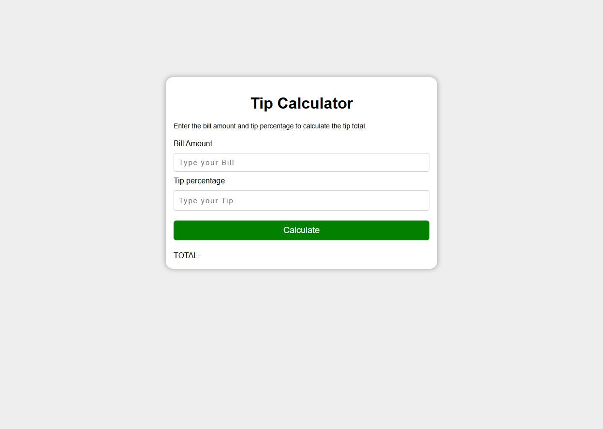

# 💸 Tip Calculator

A quick and handy tip calculator built with HTML, CSS, and JavaScript. Enter your bill amount and desired tip percentage, hit calculate, and instantly see the total amount to pay.


## ✨ Features

- 🧾 Enter any **bill amount**
- 📊 Choose a **tip percentage**
- 🟰 One-click **total calculation** — result rounded to 2 decimal places and shown in dollars
- 🎨 Clean, styled interface
- ⚡ Zero dependencies — pure vanilla JavaScript

## 🛠️ Tech Stack

- HTML5
- CSS3
- Vanilla JavaScript (event listeners, DOM updates)

## 📂 Project Structure

```
Tip-Calculator/
├── index.html       # Input fields & calculate button
├── style.css        # App styling
├── app.js           # Tip calculation logic
└── screenshot.png   # App screenshot
```

## 🚀 Getting Started

1. Clone the repository
   ```bash
   git clone https://github.com/shena9y/Tip-Calculator.git
   ```
2. Open `index.html` in your browser.
3. Type the bill amount and tip %, then click **Calculate** to see your total.

## 📸 Screenshot



## 📝 License

This project is open source and available under the [MIT License](LICENSE).
